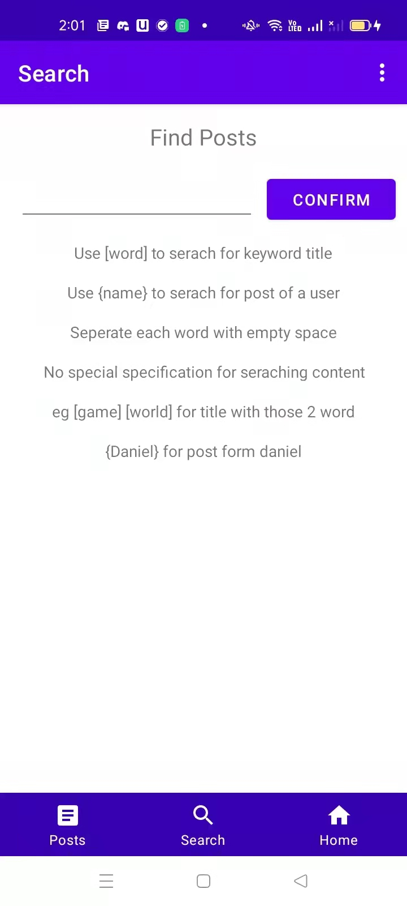
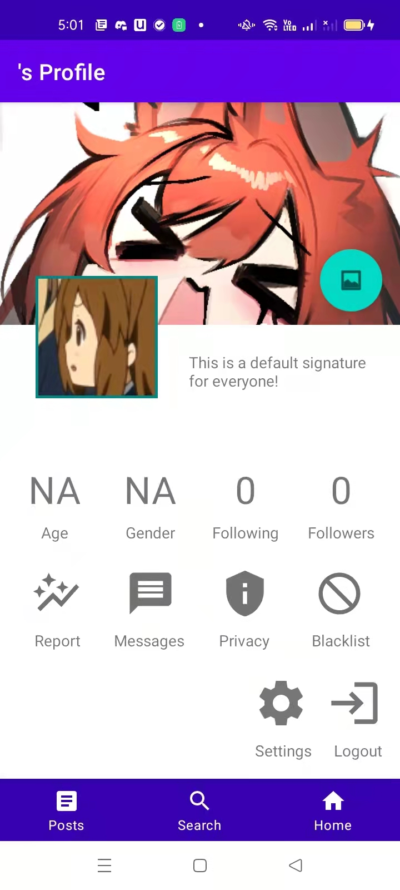

# [Team Name] Report

The following is a report template to help your team successfully provide all the details necessary for your report in a structured and organised manner. Please give a straightforward and concise report that best demonstrates your project. Note that a good report will give a better impression of your project to the reviewers.
*Here are some tips to write a good report:*

* *Try to summarise and list the `bullet points` of your project as many as possible rather than give long, tedious paragraphs that mix up everything together.*

* *Try to create `diagrams` instead of text descriptions, which are more straightforward and explanatory.*

* *Try to make your report `well structured`, which is easier for the reviewers to capture the necessary information.*

*We give instructions enclosed in square brackets [...] and examples for each sections to demonstrate what are expected for your project report.*

*Please remove the instructions or examples in `italic` in your final report.*

## Table of Contents

1. [Team Members and Roles](#team-members-and-roles)
2. [Summary of Individual Contributions](#summary-of-individual-contributions)
3. [Conflict Resolution Protocol](#conflict-resolution-protocol)
4. [Application Description](#application-description)
5. [Application UML](#application-uml)
6. [Application Design and Decisions](#application-design-and-decisions)
7. [Summary of Known Errors and Bugs](#summary-of-known-errors-and-bugs)
8. [Testing Summary](#testing-summary)
9. [Implemented Features](#implemented-features)
10. [Team Meetings](#team-meetings)

## Team Members and Roles

| UID | Name | Role |
| :--- | :----: | ---: |
| [u7253519] | [Jack Fan] | [] |
| [uid] | [Dai Boyu] | [] |
| [uid] | [Haoting Chen] | [] |
| [uid] | [Zhengling Zhang] | [] |

## Summary of Individual Contributions

*[Summarise the contributions made by each member to the project, e.g. code implementation, code design, UI design, report writing, etc.]*

*[Code Implementation. Which features did you implement? Which classes or methods was each member involved in? Provide an approximate proportion in pecentage of the contribution of each member to the whole code implementation, e.g. 30%.]*

*Here is an example:*

*UID1, Name1, I contribute 30% of the code. Here are my contributions:*
* A.class
* B.class: function1(), function2(), ...
* ....

*[Code Design. What design patterns, data structures, did the involved member propose?]*

*[UI Design. Specify what design did the involved member propose? What tools were used for the design?]*

*[Report Writing. Which part of the report did the involved member write?]*

*[Slide preparation. Were you responsible for the slides?]*

*[Miscellaneous contributions. You are welcome to provide anything that you consider as a contribution to the project or team.]*

## Conflict Resolution Protocol

*[Write a well defined protocol your team can use to handle conflicts. That is, if your group has problems, what is the procedure for reaching consensus or solving a problem? (If you choose to make this an external document, link to it here)]*

## Application Description

In our app, we try to build an app that allows users to post and share information. As an analogy, it should be similar to Reddit. Users can post about any topic that they want,
,and other users would be able to view the post and make response. 

**Application Use Cases and or Examples**

We expect our app to be used for communication and sharing information, when users want to ask a question, share their thoughts on something or simply post something interesting that they see.
For example, if one of our users wants to ask a question about a comp lab, then he/she can post that question on our app. Then, other users
would be able to see that post in their app and be able to make a response.

*Targets Users: Students*

* Students can use this app to post interesting experiences they have at scholl
* Students can use this app to share problems they have regarding courses

*Target Users: Gamers*

* *Users can use this app to post questions that they encounter in a game*

*List all the use cases in text descriptions or create use case diagrams. Please refer to https://www.visual-paradigm.com/guide/uml-unified-modeling-language/what-is-use-case-diagram/ for use case diagram.*

## Application UML

*[Replace the above with a class diagram. You can look at how we have linked an image here as an example of how you can do it too.]*

## Application Design and Decisions

*Please give clear and concise descriptions for each subsections of this part. It would be better to list all the concrete items for each subsection and give no more than `5` concise, crucial reasons of your design. Here is an example for the subsection `Data Structures`:*

*I used the following data structures in my project:*

1. *HashSet*

   * *Objective: It is used for storing blacklist, subscriptions list and followers of each user

   * *Locations: line 33 - 35 in java/com.example.login/DataContainer/Me and line 15-19 in DataContainer/Somone

   * *Reasons:*

     * *It is easy to edit and make changes since Hashset implements the add, delete and contains method, and is not constrained by size.

     * *Each of these lists, we want to achieve it so that there`s no repeat, and Hashset can check that function for us.

2. *<ArrayList>*
   * *Objective: It is used for storing comments in each post
   * *Locations: line 40 in java/com.example.login/DataContainer/Post 
      * *Reasons:*

      * *It is easy to edit and make changes with the add method of arraylist

      * *Unlike Hashset, Arraylist allows existence of multiple elements, so it`s better for storing comments.
   
3. *AVL Tree*

**Design Patterns**

*[SingleTon]
Location: DataContainer/Me, this whole class was implemented with the singleton design pattern.
Reason: For our app, the "Me" class is used to store the current user who`s logged in. Since there can only be on user logging in 
in one app, we use the singleton design pattern so that everytime an instance of Me is accessed from within the app, it is 
guaranteed to give us the only current user. And only when there is a login, a new instance of Me would be created and the old
one is being replaced.

*[DAO]
Location: Database/UserDAO, Database/UserDAOImpl
Reason: In this section of the app, we want to store the information of each user and each post in our database, and allow users
to access a particular part of the database that we provide them, yet hide deeper information. The DAO design pattern is the 
best tool for this, since it allows us to give users the access to some information, while keeping the rest hidden.

**Grammar(s)**

  *Production Rules*  
\<Non-Terminal> ::= \<some output>
 
\<Non-Terminal> ::= \<some output>

*[How do you design the grammar? What are the advantages of your designs?]*

*If there are several grammars, list them all under this section and what they relate to.*

**Tokenizer and Parsers**

*In our app, we mainly used parser and tokenizer in our search function. This is implemented because we think that it would 
help our users better constraint the content that they want to search for, and they would be able to find what they want more
easily. For example, when the search key word is added with "[]", then the search would be constrained to only search for 
posts that are published by these users, and when the key word is constrained in "{}", the search would only be directed towards
posts with the key word in its title.

Code: java/com.example.login/parserAndTokenizer
java/com.example.login/Activity/SearchPage, line 53 - 67
**Surpise Item**

*[If you implement the surprise item, explain how your solution addresses the surprise task. What decisions do your team make in addressing the problem?]*

**Other**

*[What other design decisions have you made which you feel are relevant? Feel free to separate these into their own subheadings.]*

## Summary of Known Errors and Bugs

*[Where are the known errors and bugs? What consequences might they lead to?]*

*Here is an example:*

1. *Bug 1:*

- *After using the databases for a long time, the databases needs to be deleted and recreated to let the app function normally.

*List all the known errors and bugs here. If we find bugs/errors that your team does not know of, it shows that your testing is not thorough.*

## Testing Summary

*[What features have you tested? What is your testing coverage?]*

*Censor function test*

*Number of test cases: 2*

*Code coverage: AndroidTest/com.example.login/CensorTest, java/com.example.login/Database/HelperMethod, line 171 - 177

*Types of tests created: white box testing*

*Test purpose: see if the censored function works as expected*

*[Add image]

*DatabaseFacadeTest*

*Number of test cases: 6*

*Code coverage: AndroidTest/com.example.login/DatabaseFacadeTest, java/com.example.login/Database/UserDaoImpl, line 311 - 507

*Types of tests created: white box testing*

*Test purpose: Check if the database`s login and follower functions work as expected*

*[Add image]

*ExampleInstrumentedTest*

*Number of test cases: 1*

*Code coverage: AndroidTest/com.example.login/ExampleInstrumentedTest

*Types of tests created: white box testing*

*Test purpose: check if the application context would be as expected*

*[Add image]

*getDateTimeTest*

*Number of test cases: 1*

*Code coverage: AndroidTest/com.example.login/HelperMethodsTest, line 26 - 30

*Types of tests created: white box testing*

*Test purpose: check if the correct date and time would be returned using the getDate function*

*[Add image]

*isValidCommentOrMessageTest*

*Number of test cases: 3*

*Code coverage: AndroidTest/com.example.login/HelperMethodsTest, line 34 - 43

*Types of tests created: white box testing*

*Test purpose: check if the message check valid function works as expected*

*[Add image]

*commentsEncodeDecodeTest*

*Number of test cases: 4*

*Code coverage: AndroidTest/com.example.login/HelperMethodsTest, line 47 - 68

*Types of tests created: white box testing*

*Test purpose: check if messages would be encoded in the database and decoded as expected

*[Add image]

*commentsEncodeDecodeTest*

*Number of test cases: 4*

*Code coverage: AndroidTest/com.example.login/HelperMethodsTest, line 47 - 68

*Types of tests created: white box testing*

*Test purpose: check if comments would be encoded in the database and decoded as expected

*[Add image]

*messagesEncodeDecodeTest*

*Number of test cases: 4*

*Code coverage: AndroidTest/com.example.login/HelperMethodsTest, line 71 - 95

*Types of tests created: white box testing*

*Test purpose: check if messages would be encoded in the database and decoded as expected

*[Add image]

*getPostTest*

*Number of test cases: 11*

*Code coverage: AndroidTest/com.example.login/PostDAOTest, line 52 - 64

*Types of tests created: white box testing*

*Test purpose: check if posts can be acquired from database by their id normally

*[Add image]

*getAllPosts*

*Number of test cases: 3*

*Code coverage: AndroidTest/com.example.login/PostDAOTest, line 68 - 82

*Types of tests created: white box testing*

*Test purpose: check if the getAllPosts function can actually get all the posts in the database

*[Add image]

*setLikeViewTest*

*Number of test cases: 3*

*Code coverage: AndroidTest/com.example.login/PostDAOTest, line 88 - 116

*Types of tests created: white box testing*

*Test purpose: check if the views and likes of each post can be edited normally

*[Add image]

*addLikeViewTest*

*Number of test cases: 3*

*Code coverage: AndroidTest/com.example.login/PostDAOTest, line 120 - 142

*Types of tests created: white box testing*

*Test purpose: check if the views and likes of each post can be added normally

*[Add image]

*postMatch*

*Number of test cases: 1*

*Code coverage: AndroidTest/com.example.login/PostDAOTest, line 146 - 164

*Types of tests created: white box testing*

*Test purpose: check if the post author could be matched with the key word during search

*[Add image]

*contnetMatchTest*

*Number of test cases: 1*

*Code coverage: AndroidTest/com.example.login/PostDAOTest, line 168 - 184

*Types of tests created: white box testing*

*Test purpose: check if the post content could be matched with the key word during search

*[Add image]

*postIDAssignerTest*

*Number of test cases: 5*

*Code coverage: AndroidTest/com.example.login/PostIdAssignerTest

*Types of tests created: white box testing*

*Test purpose: check if the post id would assigned successfully, and if the assigned id for each post would be different

*[Add image]

*postRWTest*

*Number of test cases: 2*

*Code coverage: AndroidTest/com.example.login/PostRWTest

*Types of tests created: white box testing*

*Test purpose: check if post would function normally on and Android device

*[Add image]

*passwordDOATest*

*Number of test cases: 3*

*Code coverage: AndroidTest/com.example.login/UserDAOTest, line 73 - 84

*Types of tests created: white box testing*

*Test purpose: check if the password would match for the expected user

*[Add image]

*ageDOATest*

*Number of test cases: 3*

*Code coverage: AndroidTest/com.example.login/UserDAOTest, line 88 - 100

*Types of tests created: white box testing*

*Test purpose: check if the age would match for the expected user

*[Add image]

*followingTest*

*Number of test cases: 4*

*Code coverage: AndroidTest/com.example.login/UserDAOTest, line 104 - 122

*Types of tests created: white box testing*

*Test purpose: check if the following list would match for the expected user

*[Add image]

*getFollowerTest*

*Number of test cases: 4*

*Code coverage: AndroidTest/com.example.login/UserDAOTest, line 127 - 139

*Types of tests created: white box testing*

*Test purpose: check if the follower list would match for the expected user

*[Add image]

*signatureTest*

*Number of test cases: 4*

*Code coverage: AndroidTest/com.example.login/UserDAOTest, line 144 - 158

*Types of tests created: white box testing*

*Test purpose: check if the signature would match for the expected user

*[Add image]

*genderDOATest*

*Number of test cases: 4*

*Code coverage: AndroidTest/com.example.login/UserDAOTest, line 161 - 177

*Types of tests created: white box testing*

*Test purpose: check if the gender would match for the expected user

*[Add image]

*locationDOATest*

*Number of test cases: 4*

*Code coverage: AndroidTest/com.example.login/UserDAOTest, line 179 - 195

*Types of tests created: white box testing*

*Test purpose: check if the location would match for the expected user

*[Add image]

*privacySettingDOATest*

*Number of test cases: 4*

*Code coverage: AndroidTest/com.example.login/UserDAOTest, line 197 - 214

*Types of tests created: white box testing*

*Test purpose: check if the privacy settings would match for the expected user

*[Add image]

*blacklistDOATest*

*Number of test cases: 4*

*Code coverage: AndroidTest/com.example.login/UserDAOTest, line 217 - 236

*Types of tests created: white box testing*

*Test purpose: check if the blacklist would match for the expected user

*[Add image]

*historyDOATest*

*Number of test cases: 4*

*Code coverage: AndroidTest/com.example.login/UserDAOTest, line 238 - 258

*Types of tests created: white box testing*

*Test purpose: check if the history would match for the expected user

*[Add image]

*messageDOATest*

*Number of test cases: 2*

*Code coverage: AndroidTest/com.example.login/UserDAOTest, line 260 - 276

*Types of tests created: white box testing*

*Test purpose: check if the messages would match for the expected user

*[Add image]

*sendMessageTest*

*Number of test cases: 4*

*Code coverage: AndroidTest/com.example.login/UserDAOTest, line 279 - 298

*Types of tests created: white box testing*

*Test purpose: check if the message sent by user would be as expected

*[Add image]

*sendEmptyMessageTest*

*Number of test cases: 4*

*Code coverage: AndroidTest/com.example.login/UserDAOTest, line 300 - 318

*Types of tests created: white box testing*

*Test purpose: check if sending an empty message would be ok and wouldn`t cause an error

*[Add image]

*getMyDataTest*

*Number of test cases: 13*

*Code coverage: AndroidTest/com.example.login/UserDAOTest, line 320 - 340

*Types of tests created: white box testing*

*Test purpose: check if the correct information can be returned for the logged in user when the password is correct

*[Add image]

*getSomeoneDataTest*

*Number of test cases: 17*

*Code coverage: AndroidTest/com.example.login/UserDAOTest, line 342 - 370

*Types of tests created: white box testing*

*Test purpose: check if the correct information can be returned when trying to visit other user`s(not logged in user`s) profile page

*[Add image]

## Implemented Features

*[What features have you implemented?]*

*Here is an example:*

*Greater Data Usage, Handling and Sophistication*
1. *Feature 1: User profile activity containing a media file (image, animation (e.g. gif), video). (easy*
   Code: java/com.example.login/Activity/Home, line 89 - 94, 205 - 257
   java/com.example.login/Activity/PostCreate, line 81 - 121
   java/com.example.login/Activity/PostView, line 61 - 72
   
   
2. *Feature 2: . Use GPS information (see the demo presented by our tutors. For example, your app
   may use the latitude/longitude to show some information relevant to your app). (easy)
   Code: 
   

3. *Feature 3: Report viewer. Provide users with the ability to see a report of interactions with your app
   (e.g., total views, total likes, total raised for a campaign, etc, in a graphical manner.
   (medium)*
   Code: java/com.example.login/Activity/ReportPage
   java/com.example.login/Activity/Home, line 183 - 190
   

*User Interactivity*
1. *Feature 1: The ability to micro-interact with items in your app (e.g. like/dislike/support/report a
   post/message/event) [stored in-memory]. (easy)
   Code: java/com.example.login/Activity/PostView, line 73 - 82, 105 - 133
   
   
2. *Feature 2: The ability to ‘follow’ users, events, movements, hashtags, topics. There must be a
   section specifically dedicated to 'things' followed. [stored in-memory] (medium)*
   Code: java/com.example.login/Activity/HomeSome, line 113 - 139
   java/com.example.login/Activity/HomeUserList
   java/com.example.login/Activity/HomeUserListAdapter
   
   

*Privacy*
1. Users may send requests which are then accepted or denied by another user or
   organisation (e.g., a request to follow an event, a person or organisation). (easy)
   Code: 
2. A user can only see a profile/event that is Public (consider that there are at least two
   types of profiles: public and private). (easy)
   Code:  java/com.example.login/Activity/HomePrivacy
   
   
3. Provide users with the ability to ‘block’ things. Things (e.g., events, users, messages
       containing abusive language, etc) shall not be visible to the user who blocked that
       activity. (medium)
   Code: java/com.example.login/Activity/HomePrivacy, line 82 - 87
   java/com.example.login/Database/HelperMethods, line 167 - 177
   
   
*Peer to Peer Messaging*
1. Provide users with the ability to message each other or an institution directly (e.g., a
   user can message an event/movement that is managed by another user). (hard)
   Code: java/com.example.login/Activity/Messages
   java/com.example.login/Activity/MessagesAdapter
   java/com.example.login/Activity/MessagesAddPage
   java/com.example.login/Activity/MessagesChat
   java/com.example.login/Activity/MessagesChatAdapter
   
   

*List all features you have completed in their separate categories with their difficulty classification. If they are features that are suggested and approved, please state this somewhere as well.*

## Team Meetings

*Here is an example:*

- *[Team Meeting 1](MeetingTemplate.md)*
- ...

*Either write your meeting minutes here or link to documents that contain them. There must be at least 4 team meetings. Note that you must commit your minute meetings shortly after your meeting has taken place (e.g., within 24h), otherwise your meeting minute will not be accepted.*

