# [Simpost] Report

The following is a report template to help your team successfully provide all the details necessary for your report in a structured and organised manner. Please give a straightforward and concise report that best demonstrates your project. Note that a good report will give a better impression of your project to the reviewers.
*Here are some tips to write a good report:*

* *Try to summarise and list the `bullet points` of your project as many as possible rather than give long, tedious paragraphs that mix up everything together.*

* *Try to create `diagrams` instead of text descriptions, which are more straightforward and explanatory.*

* *Try to make your report `well structured`, which is easier for the reviewers to capture the necessary information.*

*We give instructions enclosed in square brackets [...] and examples for each sections to demonstrate what are expected for your project report.*

*Please remove the instructions or examples in `italic` in your final report.*
<hr>
## Table of Contents

1. [Team Members and Roles](#team-members-and-roles)
2. [Summary of Individual Contributions](#summary-of-individual-contributions)
3. [Conflict Resolution Protocol](#conflict-resolution-protocol)
4. [Application Description](#application-description)
5. [Application UML](#application-uml)
6. [Application Design and Decisions](#application-design-and-decisions)
7. [Summary of Known Errors and Bugs](#summary-of-known-errors-and-bugs)
8. [Testing Summary](#testing-summary)
9. [Implemented Features](#implemented-features)
10. [Team Meetings](#team-meetings)
<hr>
## Team Members and Roles

| UID | Name | Role |
| :--- | :----: | ---: |
| [u7253519] | [Jack Fan] | [Designing layout and button, text logic] |
| [u7241110] | [Dai Boyu] | [Implementing search function with parser and tokenizer, implementing tree and Json] |
| [u7227871] | [Haoting Chen] | [Implementing database] |
| [u7323177] | [Zhengling Zhang] | [Creating Messages] |

## Summary of Individual Contributions

*[Summarise the contributions made by each member to the project, e.g. code implementation, code design, UI design, report writing, etc.]*

*[Code Implementation. Which features did you implement? Which classes or methods was each member involved in? Provide an approximate proportion in pecentage of the contribution of each member to the whole code implementation, e.g. 30%.]*

*Here is an example:*

*UID1, Name1, I contribute 30% of the code. Here are my contributions:*
* A.class
* B.class: function1(), function2(), ...
* ....

*[Code Design. What design patterns, data structures, did the involved member propose?]*

*[UI Design. Specify what design did the involved member propose? What tools were used for the design?]*

*[Report Writing. Which part of the report did the involved member write?]*

*[Slide preparation. Were you responsible for the slides?]*

*[Miscellaneous contributions. You are welcome to provide anything that you consider as a contribution to the project or team.]*
<hr>
## Conflict Resolution Protocol

*[Write a well defined protocol your team can use to handle conflicts. That is, if your group has problems, what is the procedure for reaching consensus or solving a problem? (If you choose to make this an external document, link to it here)]*
<hr>
## Application Description

In our app, we try to build an app that allows users to post and share information. As an analogy, it should be similar to Reddit. Users can post about any topic that they want,
,and other users would be able to view the post and make response.


**Application Use Cases and or Examples**

We expect our app to be used for communication and sharing information, when users want to ask a question, share their thoughts on something or simply post something interesting that they see.
For example, if one of our users wants to ask a question about a comp lab, then he/she can post that question on our app. Then, other users
would be able to see that post in their app and be able to make a response.

*Targets Users: Students*

* Students can use this app to post interesting experiences they have at scholl
* Students can use this app to share problems they have regarding courses

*Target Users: Gamers*

* *Users can use this app to post questions that they encounter in a game*


*List all the use cases in text descriptions or create use case diagrams. Please refer to https://www.visual-paradigm.com/guide/uml-unified-modeling-language/what-is-use-case-diagram/ for use case diagram.*
<hr>
## Application UML


*[Replace the above with a class diagram. You can look at how we have linked an image here as an example of how you can do it too.]*
<hr>
## Application Design and Decisions

*Please give clear and concise descriptions for each subsections of this part. It would be better to list all the concrete items for each subsection and give no more than `5` concise, crucial reasons of your design. Here is an example for the subsection `Data Structures`:*

*I used the following data structures in my project:*

1. *HashSet*

   * *Objective: It is used for storing blacklist, subscriptions list and followers of each user

   * *Locations: line 33 - 35 in java/com.example.login/DataContainer/Me and line 15-19 in DataContainer/Somone

   * *Reasons:*

      * *It is easy to edit and make changes since Hashset implements the add, delete and contains method, and is not constrained by size.

      * *Each of these lists, we want to achieve it so that there`s no repeat, and Hashset can check that function for us.

2. *<ArrayList>*
   * *Objective: It is used for storing comments in each post
   * *Locations: line 40 in java/com.example.login/DataContainer/Post
      * *Reasons:*

      * *It is easy to edit and make changes with the add method of arraylist

      * *Unlike Hashset, Arraylist allows existence of multiple elements, so it`s better for storing comments.

3. *AVL Tree*
   * Objective:using tree to store the login information of the user to speed up the login.
      * *Reasons:*
      * searching is faster in side a tree compare to arraylists

<hr>
**Design Patterns**

*[SingleTon] <br>
Location: DataContainer/Me.java
<br>
<br>
this whole class was implemented with the singleton design pattern.
Reason: For our app, the "Me" class is used to store the current user who`s logged in. Since there can only be on user logging in
in one app, we use the singleton design pattern so that everytime an instance of Me is accessed from within the app, it is
guaranteed to give us the only current user. And only when there is a login, a new instance of Me would be created and the old
one is being replaced.

*[State]
Location: java/com.example.login/DataContainer/User, java/com.example.login/DataContainer/Someone, java/com.example.login/DataContainer/Me
Reason: In this section, we want to separate two different states of user - logged in state and logged out state.
This makes it easy to create and distinguish different pages for viewing the current users own profile page and other users profile
page, and allow us to identify when the user is logged in or not.

*[DAO]
Location: Database/UserDAO, Database/UserDAOImpl
<br>
<br>
Reason: In this section of the app, we want to store the information of each user and each post in our database, and allow users
to access a particular part of the database that we provide them, yet hide deeper information. The DAO design pattern is the
best tool for this, since it allows us to give users the access to some information, while keeping the rest hidden.


<hr>
<div>

<h3>Grammar(s)</h3>
<p>
<br> *Production Rules* <br>
Word ::= [terminal] + Word<br>
Word ::= {terminal} + word<br>
Word ::= termianl(a english word)
<br>
The grammer is mainly used to enablt user to search for different posts 
</p>

<h3>Tokenizer and Parsers</h3>
<p>*In our app, we mainly used parser and tokenizer in our search function. This is implemented because we think that it would
**Tokenizer and Parsers**

*In our app, we mainly used parser and tokenizer in our search function. This is implemented because we think that it would
help our users better constraint the content that they want to search for, and they would be able to find what they want more
easily. For example, when the search key word is added with "[]", then the search would be constrained to only search for
posts that are published by these users, and when the key word is constrained in "{}", the search would only be directed towards
posts with the key word in its title.</p>


<p>
posts with the key word in its title.<br>
<br><br>
Code: java/com.example.login/parserAndTokenizer <br>
java/com.example.login/Activity/SearchPage <br>
To improve the efficiency of the search we used the fts(4) extension in the assignment
which is significantly faster than ordinary sqlite matching
</p>
</div>
<hr>
<div>
   <h1>Suprise Item</h1>
   *[If you implement the surprise item, explain how your solution addresses the surprise task. What decisions do your team make in addressing the problem?]*
</div>
<hr>
<h2>Activities and functions</h2>
<div title="User Login and signup" style="text-align: center;">
   <h3>user login and registering</h3>
   <p>
   As the application is first open the appliction owuld directly show a login and registering page. Where user login<br>
   </p>
   <div class="half" style="text-align: center;">
   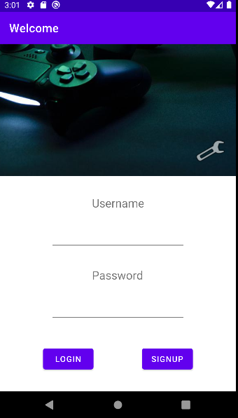
   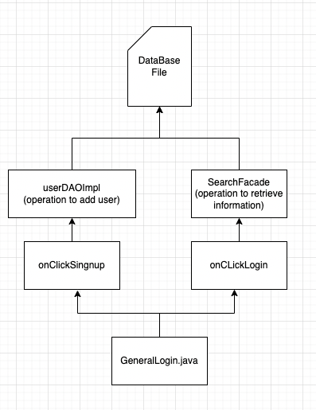
   </div>
    <h3>User Home Page</h3>
   <p>
   After the user login, he/she can choose to visit their home profile page by clicking the "Home" button. In this page, he/she can choose to edit his profile, change his privacy settings, add images as background or avatar, send messages to others, or checkout users he`s following/fans/blacklist. 
   </p>
   <div class="half" style="text-align: center;">
   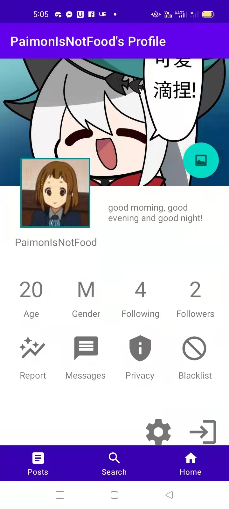
   </div>
 
<br>
**Surpise Item**

*[If you implement the surprise item, explain how your solution addresses the surprise task. What decisions do your team make in addressing the problem?]*
<br>
</div>

<hr>
<div title="Adniistrator functions" style="text-align: center;">
   <h3>Administor</h3>
   <p>
      As some may notice that there is another button at the login page ( a wrench).
      This would lead to the page where possible administrator managing the content of the application
   </p>
   <br>
   <div class="half" style="text-align: center;">
      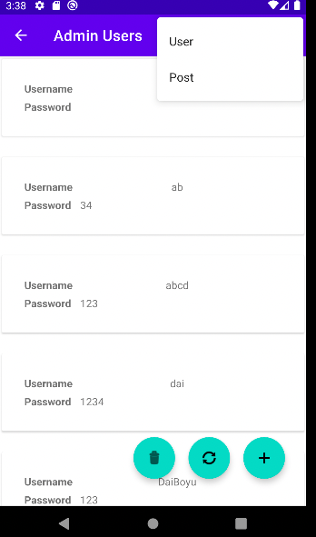
      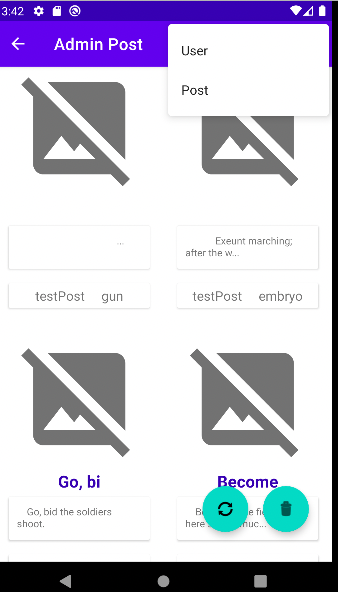
   </div>
</div>


<hr>
<div title="Personal statistics" style="text-align: center;">
   <h3>Statistic about the user</h3>
   <p>
      In this project enable the user to view statistic about the user's himself this include many different aspects
      this includes proprttion of view with like. the gender distribution of the viewer
   </p>
   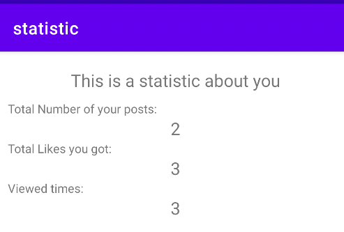
   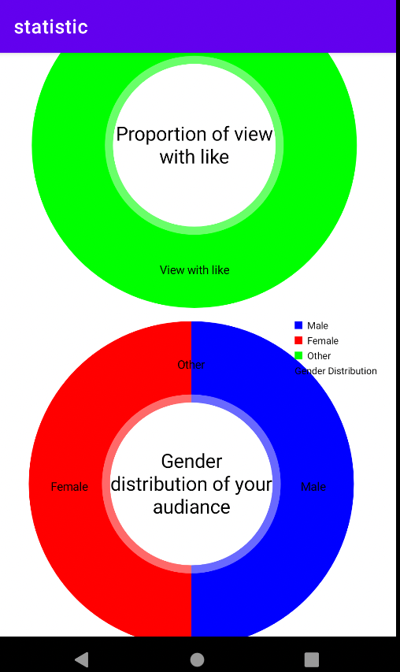
</div>

<h1>ZZLPart</h1>
**Message**
<br>
In the implementation of information exchange between users, we designed a button in the homepage called "Message" through which we can go to the message page. 
In the message page, we enabled users to chat with each other in a mailbox. 
Every user can send a message to another user with two text input, user sent to and message content. (CALL THEM A AND B)
With the "Send" button clicked, A and B will be encoded to Message type and then stored into the database.
When a user visit message page, the database will check every message related to the current user and show the information on a recycle view, sorted by time.
With the recycle view, the user can roll the page to any message he or she wants to check. And click it into the MessageChat page to view the detail.<br>
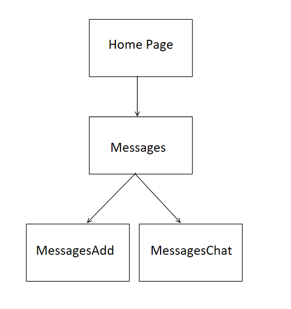<br>
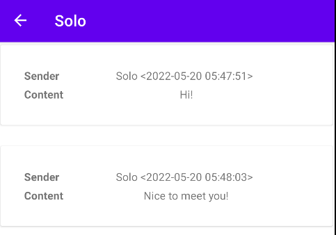<br>


<h1>Jack Part</h1>

<hr>
<div title="Privacy Setting" style="text-align: center;">
   <h3>Privacy Settings</h3>
   <p>
      Many users might have private information that they don`t want others to see, therefore, we also allow users to set their privacy settings in the HomePrivacy Page. Users can choose to set their age, gender, location, follower, following lists to be hidden, and each of these buttons were implemented with a switch, since there are on and off states. Other than that, we also allow users to choose whether they want offensive words to be censored, since some users might be ok with these, while others might considered these very offensive. 
   </p>
   <div class="half" style="text-align: center;">
      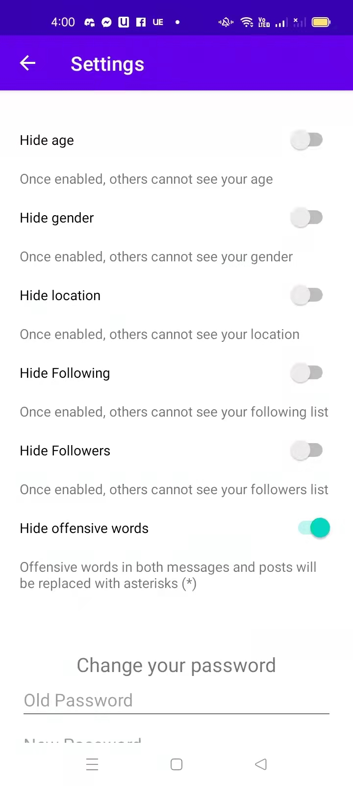
   </div>
</div>

<hr>
<div title="PostsPage" style="text-align: center;">
   <h3>Main page viewing all posts</h3>
   <p>
      After users login, this is the first page that they would see. In here, users will see all the recent published posts by default, but they can also choose to see posts from users they follow, posts from their view history, or posts they publish themselves.
   </p>
   <div class="half" style="text-align: center;">
      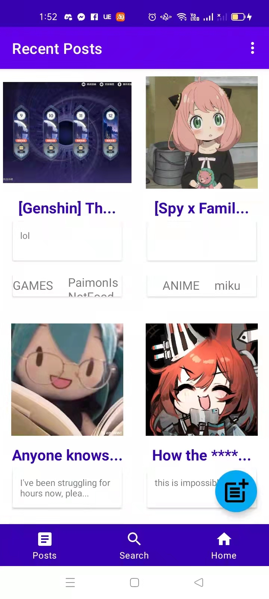
   </div>
</div>

<hr>
<div title="PostView" style="text-align: center;">

   <h3>Page for viewing a particular post</h3>
   <p>
      When the users sees a post they`re interested in from posts page or from searching, he/she can click on the post preivew and jump to the PostView Page. In here, users can see details of a post, including title, content, publish time, and images. Users may also choose to like the post with the button under the post, and if they want to view past comments or make one, they can do so by using the "comments" button.
   </p>
   <div class="half" style="text-align: center;">
      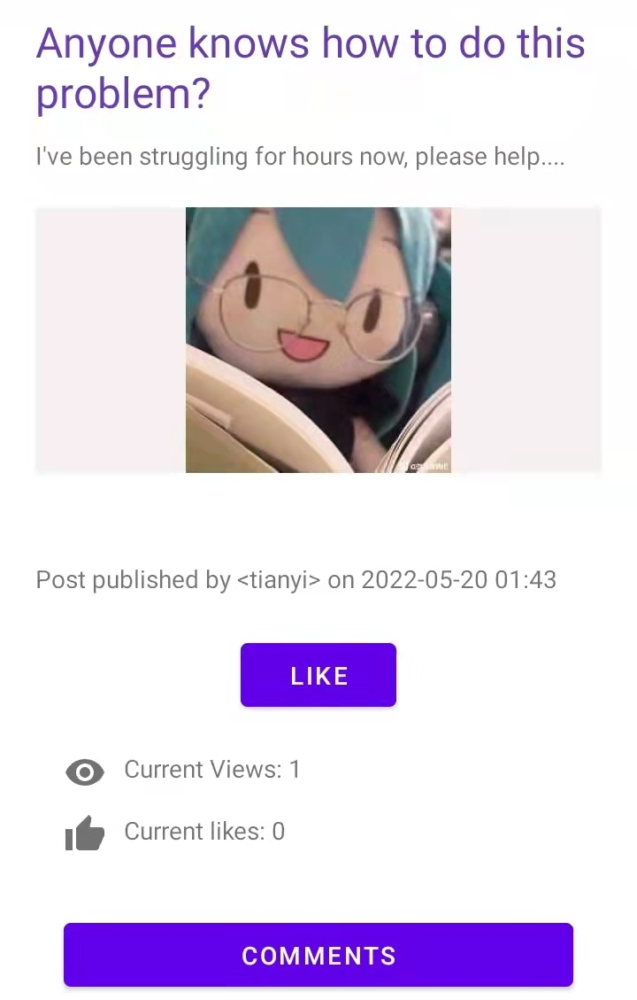
   </div>
</div>

<hr>
<div title="CreatePost" style="text-align: center;">
   <h3>Page for creating a post</h3>
   <p>
     In the posts page, user may also choose to publish their own post by clicking the bottom right button. When creating, users can add title, content, images and tag to the post. We only allow a maximum of 3 images, since it is easier to store in databse this way and we don`t want each post to be too filled with images. The tag function makes it easier for us to sort the posts, and also allow users to identify posts they would be interested in.
   </p>
   <div class="half" style="text-align: center;">
      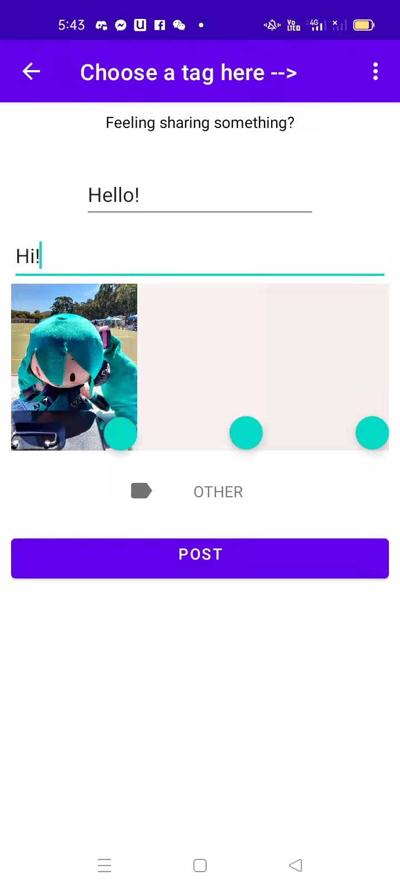
   </div>
</div>

<h1>Daniel Part</h1>
**Other**
<br>
**AVLTreeAdater**
<br>
Code: app/src/main/java/com/example/login/tree/AVLTreeAdapter.java <br>
<br>
this class is built as an extension to Gson (). While we are trying to serialist tree to JSON files it
is found that Gson is able to convert tree to Gson file but not ablt to convert it back as the tree is not a
simple data sturcture
```raw
        GsonBuilder builder = new GsonBuilder();
        builder.registerTypeAdapter(AVLTree.class, new AVLTreeAdapter());
        Gson tson = builder.create();
        tson.fromJson()
```

Gson object build using this way is ablt to decode Json serialised tree. However,it is still unstable
it is ablt to conver some tree in testing but not able to convert some other tree
<br>

**FileRW**
<br>
Code:app/src/main/java/com/example/login/FileIO
<br>
This is a helper class that provide fuctions for saving string as a json file under
the application's private space and loading JSON file as a string
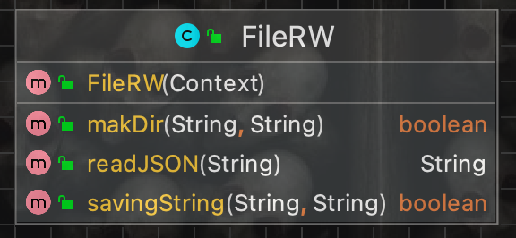<br>
<br>

**Playing Sound in android**
<br>
As it might be notice that this appliction plays sound as user press certain button.
Using this function a interactive game is implemnted with search page that enable user to paly
this could be accessed at the search page
<br>
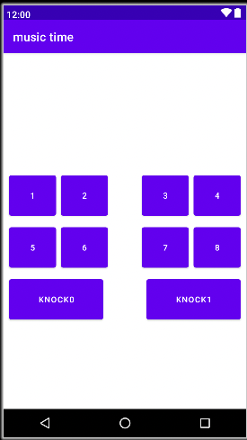<br>

**Recycle view**
<br>
When designing the Messages and AdminUser class, recycleview is used. 
We created a MessagesAdapter class which extends RecyclerView.Adapter. 
And we designed the layout of the adapter. 
In this way, we are able to show pieces of messages including the sender, time, and content.
<br>
<br>

**Database**
<br>
In app, sqlite is chosen to be the database. 
Two tables, one for users and one for posts, are created. 
In database, we realise the input of text and image. 
Also, we defined some datacontainers and helping methods to help access to database.
<br>
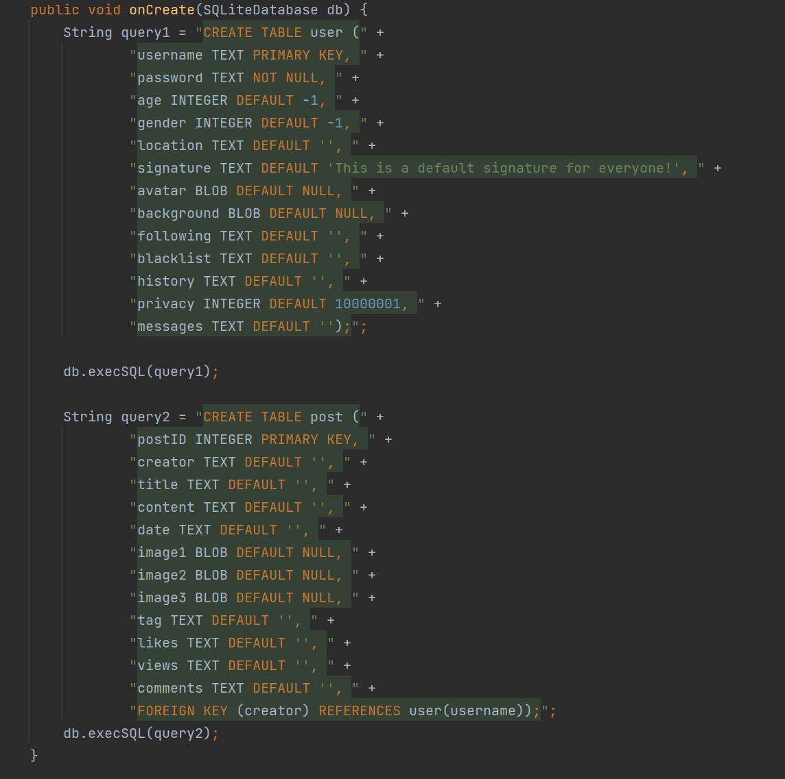<br>
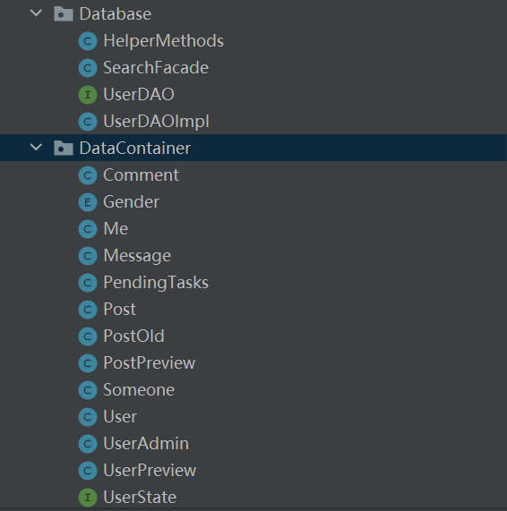<br>

## Summary of Known Errors and Bugs

*[Where are the known errors and bugs? What consequences might they lead to?]*

*Here is an example:*

1. *Bug 1:*

- *After using the databases for a long time, the databases needs to be deleted and recreated to let the app function normally.
1. *Bug 2:*

- *When choosing image for a post, if one image is selected and you choose to replace it but doesn`t choose anything, the app would report an error.


*List all the known errors and bugs here. If we find bugs/errors that your team does not know of, it shows that your testing is not thorough.*

## Testing Summary

*[What features have you tested? What is your testing coverage?]*

*Censor function test*

*Number of test cases: 2*

*Code coverage: AndroidTest/com.example.login/CensorTest, java/com.example.login/Database/HelperMethod, line 171 - 177

*Types of tests created: white box testing*

*Test purpose: see if the censored function works as expected*

*[Add image]

*DatabaseFacadeTest*

*Number of test cases: 6*

*Code coverage: AndroidTest/com.example.login/DatabaseFacadeTest, java/com.example.login/Database/UserDaoImpl, line 311 - 507

*Types of tests created: white box testing*

*Test purpose: Check if the database`s login and follower functions work as expected*

*[Add image]

*ExampleInstrumentedTest*

*Number of test cases: 1*

*Code coverage: AndroidTest/com.example.login/ExampleInstrumentedTest

*Types of tests created: white box testing*

*Test purpose: check if the application context would be as expected*

*[Add image]

*getDateTimeTest*

*Number of test cases: 1*

*Code coverage: AndroidTest/com.example.login/HelperMethodsTest, line 26 - 30,
java/com.example.login/Database/HelperMethods, line 160 - 165
java/com.example.login/DataContainer/Post, line 76

*Types of tests created: white box testing*

*Test purpose: check if the correct date and time would be returned using the getDate function*

*[Add image]

*isValidCommentOrMessageTest*

*Number of test cases: 3*

*Code coverage: AndroidTest/com.example.login/HelperMethodsTest, line 34 - 43
java/com.example.login/Database/UserDAOImpl, line 775

*Types of tests created: white box testing*

*Test purpose: check if the message check valid function works as expected*

*[Add image]


*commentsEncodeDecodeTest*

*Number of test cases: 4*

*Code coverage: AndroidTest/com.example.login/HelperMethodsTest, line 47 - 68

*Types of tests created: white box testing*

*Test purpose: check if messages would be encoded in the database and decoded as expected

*[Add image]

*commentsEncodeDecodeTest*

*Number of test cases: 4*

*Code coverage: AndroidTest/com.example.login/HelperMethodsTest, line 47 - 68
java/com.example.login/Database/HelperMethods, line 27 - 41
java/com.example.login/Activity/Comments, line 61 - 65
java/com.example.login/Activity/CommentAdapter, line 42 - 47

*Types of tests created: white box testing*

*Test purpose: check if comments would be encoded in the database and decoded as expected

*[Add image]

*messagesEncodeDecodeTest*

*Number of test cases: 4*

*Code coverage: AndroidTest/com.example.login/HelperMethodsTest, line 71 - 95
java/com.example.login/Database/HelperMethods, line 27 - 41
java/com.example.login/Activity/MessagesAddPage, line 82 - 100

*Types of tests created: white box testing*

*Test purpose: check if messages would be encoded in the database and decoded as expected

*[Add image]

*getPostTest*

*Number of test cases: 11*

*Code coverage: AndroidTest/com.example.login/PostDAOTest, line 52 - 64
java/com.example.login/DataContainer/Post, line 128


*Types of tests created: white box testing*

*Test purpose: check if posts can be acquired from database by their id normally

*[Add image]

*getAllPosts*

*Number of test cases: 3*

*Code coverage: AndroidTest/com.example.login/PostDAOTest, line 68 - 82
java/com.example.login/Database/UserDAOImpl, line 251 - 271

*Types of tests created: white box testing*

*Test purpose: check if the getAllPosts function can actually get all the posts in the database

*[Add image]

*setLikeViewTest*

*Number of test cases: 3*

*Code coverage: AndroidTest/com.example.login/PostDAOTest, line 88 - 116
java/com.example.login/Database/UserDAOImpl, line 378 - 388

*Types of tests created: white box testing*

*Test purpose: check if the views and likes of each post can be edited normally

*[Add image]

*addLikeViewTest*

*Number of test cases: 3*

*Code coverage: AndroidTest/com.example.login/PostDAOTest, line 120 - 142
java/com.example.login/Database/UserDAOImpl, line 391 - 402

*Types of tests created: white box testing*

*Test purpose: check if the views and likes of each post can be added normally

*[Add image]

*postMatch*

*Number of test cases: 1*

*Code coverage: AndroidTest/com.example.login/PostDAOTest, line 146 - 164
java/com.example.login/Database/UserDAOImpl, line 307 - 338

*Types of tests created: white box testing*

*Test purpose: check if the post author could be matched with the key word during search

*[Add image]

*contnetMatchTest*

*Number of test cases: 1*

*Code coverage: AndroidTest/com.example.login/PostDAOTest, line 168 - 184
java/com.example.login/Database/UserDAOImpl, line 340 - 371

*Types of tests created: white box testing*

*Test purpose: check if the post content could be matched with the key word during search

*[Add image]

*postIDAssignerTest*

*Number of test cases: 5*

*Code coverage: AndroidTest/com.example.login/PostIdAssignerTest
java/com.example.login/IdAssigner/PostIdAssigner

*Types of tests created: white box testing*

*Test purpose: check if the post id would assigned successfully, and if the assigned id for each post would be different

*[Add image]

*postRWTest*

*Number of test cases: 2*

*Code coverage: AndroidTest/com.example.login/PostRWTest
java/com.example.login/FileIO/FileRW

*Types of tests created: white box testing*

*Test purpose: check if post would function normally on and Android device

*[Add image]

*passwordDOATest*

*Number of test cases: 3*

*Code coverage: AndroidTest/com.example.login/UserDAOTest, line 73 - 84
java/com.example.login/Database/UserDAOImpl, line 518 - 576, 626 - 631

*Types of tests created: white box testing*

*Test purpose: check if the password would match for the expected user

*[Add image]

*ageDOATest*

*Number of test cases: 3*

*Code coverage: AndroidTest/com.example.login/UserDAOTest, line 88 - 100
java/com.example.login/Database/UserDAOImpl, line 651 - 657

*Types of tests created: white box testing*

*Test purpose: check if the age would match for the expected user

*[Add image]

*followingTest*

*Number of test cases: 4*

*Code coverage: AndroidTest/com.example.login/UserDAOTest, line 104 - 122
java/com.example.login/Database/UserDAOImpl, line 634 - 638

*Types of tests created: white box testing*

*Test purpose: check if the following list would match for the expected user

*[Add image]

*getFollowerTest*

*Number of test cases: 4*

*Code coverage: AndroidTest/com.example.login/UserDAOTest, line 127 - 139
java/com.example.login/Database/UserDAOImpl, line 737 - 754

*Types of tests created: white box testing*

*Test purpose: check if the follower list would match for the expected user

*[Add image]

*signatureTest*

*Number of test cases: 4*

*Code coverage: AndroidTest/com.example.login/UserDAOTest, line 144 - 158
java/com.example.login/Database/UserDAOImpl, line 641 - 648

*Types of tests created: white box testing*

*Test purpose: check if the signature would match for the expected user

*[Add image]

*genderDOATest*

*Number of test cases: 4*

*Code coverage: AndroidTest/com.example.login/UserDAOTest, line 161 - 177
java/com.example.login/Database/UserDAOImpl, line 659 - 665

*Types of tests created: white box testing*

*Test purpose: check if the gender would match for the expected user

*[Add image]

*locationDOATest*

*Number of test cases: 4*

*Code coverage: AndroidTest/com.example.login/UserDAOTest, line 179 - 195
java/com.example.login/Database/UserDAOImpl, line 667 - 673

*Types of tests created: white box testing*

*Test purpose: check if the location would match for the expected user

*[Add image]

*privacySettingDOATest*

*Number of test cases: 4*

*Code coverage: AndroidTest/com.example.login/UserDAOTest, line 197 - 214
java/com.example.login/Database/UserDAOImpl, line 675 - 682

*Types of tests created: white box testing*

*Test purpose: check if the privacy settings would match for the expected user

*[Add image]

*blacklistDOATest*

*Number of test cases: 4*

*Code coverage: AndroidTest/com.example.login/UserDAOTest, line 217 - 236
java/com.example.login/Database/UserDAOImpl, line 685 - 691

*Types of tests created: white box testing*

*Test purpose: check if the blacklist would match for the expected user

*[Add image]

*historyDOATest*

*Number of test cases: 4*

*Code coverage: AndroidTest/com.example.login/UserDAOTest, line 238 - 258
java/com.example.login/Database/UserDAOImpl, line 693 - 708

*Types of tests created: white box testing*

*Test purpose: check if the history would match for the expected user

*[Add image]

*messageDOATest*

*Number of test cases: 2*

*Code coverage: AndroidTest/com.example.login/UserDAOTest, line 260 - 276
java/com.example.login/Database/UserDAOImpl, line 736 - 735

*Types of tests created: white box testing*

*Test purpose: check if the messages would match for the expected user

*[Add image]

*sendMessageTest*

*Number of test cases: 4*

*Code coverage: AndroidTest/com.example.login/UserDAOTest, line 279 - 298
java/com.example.login/Database/UserDAOImpl, line 766 - 798

*Types of tests created: white box testing*

*Test purpose: check if the message sent by user would be as expected

*[Add image]

*sendEmptyMessageTest*

*Number of test cases: 4*

*Code coverage: AndroidTest/com.example.login/UserDAOTest, line 300 - 318
java/com.example.login/Database/UserDAOImpl, line 766 - 798

*Types of tests created: white box testing*

*Test purpose: check if sending an empty message would be ok and wouldn`t cause an error

*[Add image]

*getMyDataTest*

*Number of test cases: 13*

*Code coverage: AndroidTest/com.example.login/UserDAOTest, line 320 - 340
java/com.example.login/Database/UserDAOImpl, line 481 - 516

*Types of tests created: white box testing*

*Test purpose: check if the correct information can be returned for the logged in user when the password is correct

*[Add image]

*getSomeoneDataTest*

*Number of test cases: 17*

*Code coverage: AndroidTest/com.example.login/UserDAOTest, line 342 - 370
java/com.example.login/Database/UserDAOImpl, line 518 - 576

*Types of tests created: white box testing*

*Test purpose: check if the correct information can be returned when trying to visit other user`s(not logged in user`s) profile page

*[Add image]

## Implemented Features

*[What features have you implemented?]*

*Here is an example:*

*Greater Data Usage, Handling and Sophistication*
1. *Feature 1: User profile activity containing a media file (image, animation (e.g. gif), video). (easy*
   Code: java/com.example.login/Activity/Home, line 89 - 94, 205 - 257
   java/com.example.login/Activity/PostCreate, line 81 - 121
   java/com.example.login/Activity/PostView, line 61 - 72
     
   
2. *Feature 2: . Use GPS information (see the demo presented by our tutors. For example, your app
   may use the latitude/longitude to show some information relevant to your app). (easy)
   Code:  java/com.example.login/Activity/HomeSettingLocation
     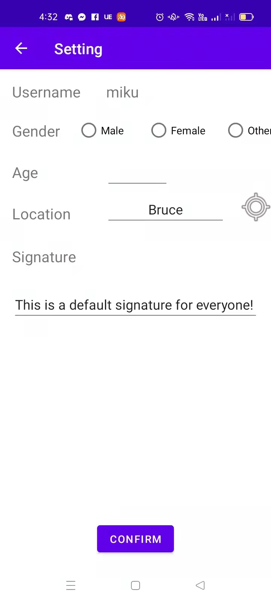
   

3. *Feature 3: Report viewer. Provide users with the ability to see a report of interactions with your app
   (e.g., total views, total likes, total raised for a campaign, etc, in a graphical manner.
   (medium)*
   Code: java/com.example.login/Activity/ReportPage
   java/com.example.login/Activity/Home, line 183 - 190
     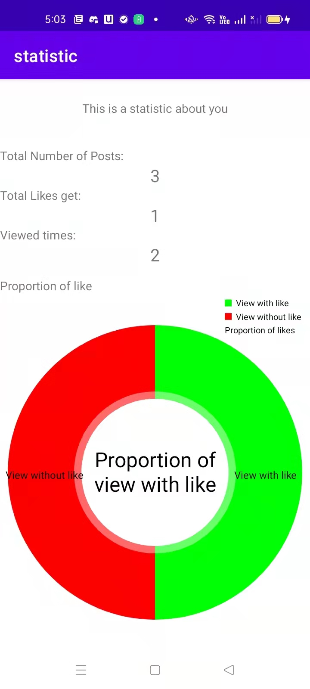

*User Interactivity*
1. *Feature 1: The ability to micro-interact with items in your app (e.g. like/dislike/support/report a
   post/message/event) [stored in-memory]. (easy)
   Code: java/com.example.login/Activity/PostView, line 73 - 82, 105 - 133
  
   
2. *Feature 2: The ability to ‘follow’ users, events, movements, hashtags, topics. There must be a
   section specifically dedicated to 'things' followed. [stored in-memory] (medium)*
   Code: java/com.example.login/Activity/HomeSome, line 113 - 139
   java/com.example.login/Activity/HomeUserList
   java/com.example.login/Activity/HomeUserListAdapter
   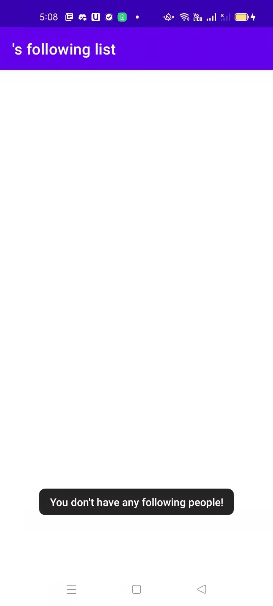
   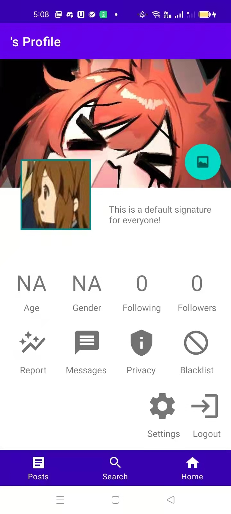

*Privacy*
1. Users may send requests which are then accepted or denied by another user or
   organisation (e.g., a request to follow an event, a person or organisation). (easy)
   Code: 
2. A user can only see a profile/event that is Public (consider that there are at least two
   types of profiles: public and private). (easy)
   Code:  java/com.example.login/Activity/HomePrivacy
     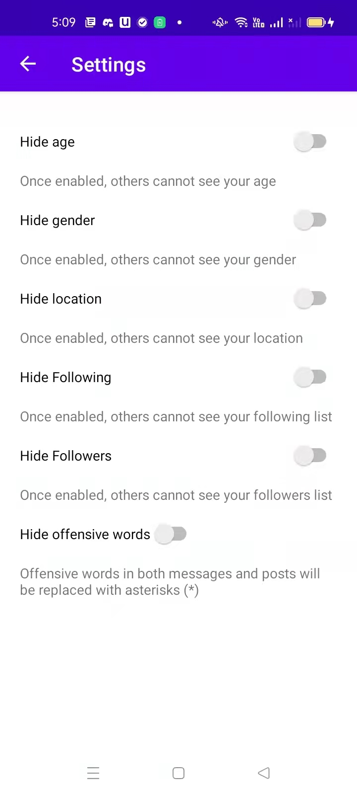
   
3. Provide users with the ability to ‘block’ things. Things (e.g., events, users, messages
       containing abusive language, etc) shall not be visible to the user who blocked that
       activity. (medium)
   Code: java/com.example.login/Activity/HomePrivacy, line 82 - 87
   java/com.example.login/Database/HelperMethods, line 167 - 177
   
   
*Peer to Peer Messaging*
1. Provide users with the ability to message each other or an institution directly (e.g., a
   user can message an event/movement that is managed by another user). (hard)
   Code: java/com.example.login/Activity/Messages
   java/com.example.login/Activity/MessagesAdapter
   java/com.example.login/Activity/MessagesAddPage
   java/com.example.login/Activity/MessagesChat
   java/com.example.login/Activity/MessagesChatAdapter
   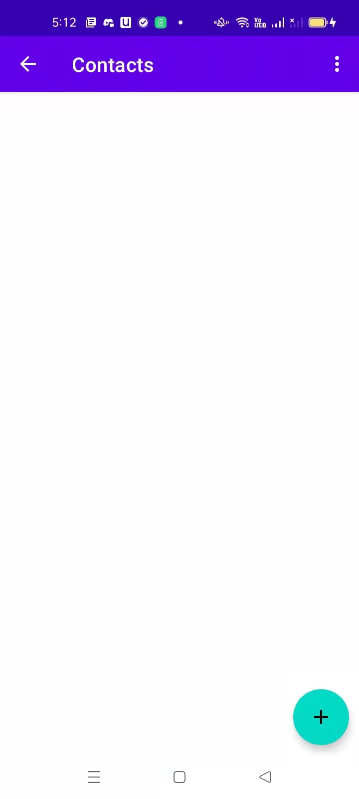
   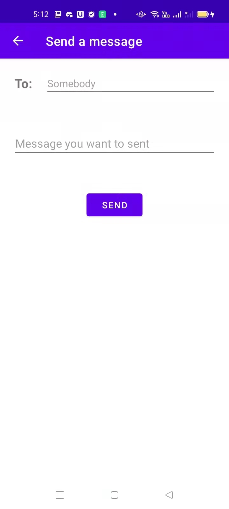

*List all features you have completed in their separate categories with their difficulty classification. If they are features that are suggested and approved, please state this somewhere as well.*

## Team Meetings

*Here is an example:*

- *[Team Meeting 1](MeetingTemplate.md)*
- ...

*Either write your meeting minutes here or link to documents that contain them. There must be at least 4 team meetings. Note that you must commit your minute meetings shortly after your meeting has taken place (e.g., within 24h), otherwise your meeting minute will not be accepted.*

